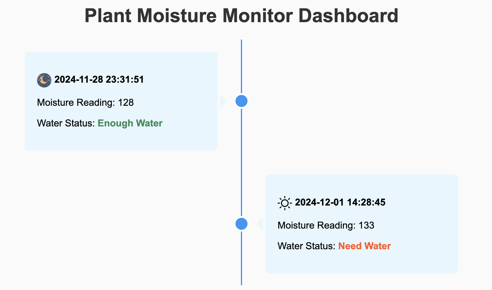

# Watering System - IoT Project

An automated plant watering system that reads soil moisture levels and activates a water pump to provide optimal hydration for plants. It can be built using platforms like **Raspberry Pi** or **Arduino** and communicates with a mobile application or self-hosted dashboard.

# Key Features
- Soil Moisture Monitoring.
- Pump Control.
- Configurable Thresholds.
- Logging.
- Monitoring dashboard.
- Mobile notification.

# Watering System Code

### Raspberry Pi with Sunfounder PCF8591 Module 

The watering system logic, including the moisture sensor readings, threshold comparison, and pump control, is implemented in the following file:
```bash
python sunfounder_component/watering_system.py
```

# Dashboard



### Run the dashboard
```bash
cd dashboard
python3 -m http.server 8000
```
# Dart & Flutter Application
If you would like to connect and view your moisture information through bluetooth to a cell phone, we also created a basic dart application for showing that data.

###To set it up:
- install and enable dart and flutter on your PC
- build the flutter application in the "DartApp" folder
- deploy the MoistureTimedBluetooth.py file to your Pi, adjust the "interval" to your preferred update time for the moisture sensor

  
# Disclaimer
This project is published under the MIT license. 
Any third-party libraries and modules used in this project are subject to their respective licenses.


